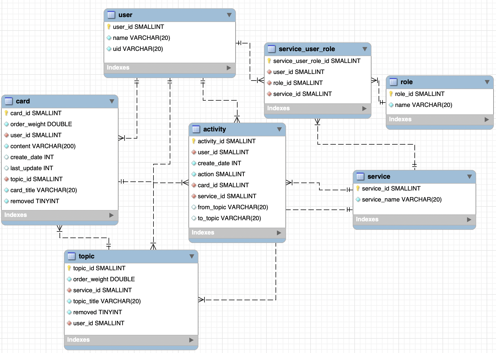

# 우아한 Todo List

- Column을 생성하고 삭제할 수 있습니다.
- 생성된 Card는 Drag and Drop 기능으로 Column을 변경할 수 있습니다.
- Card와 Column을 수정하며 원하는 목표를 설정할 수 있습니다.

**Todo List와 함께 체계적으로 작업을 관리하세요!**


## 데이터 모델링


## 설치 및 실행 방법

### 서버 설치

** mysql 설치 생략 port 3306
** /shared/config.env 파일에서 서버 및 데이터베이스 host 설정 필요!

```
git clone https://github.com/woowa-techcamp-2020/todo-5.git
cd todo-5/client
npm install -g typescript
npm install
npm run build
cd ../server
npm install  // to install all the dependencies.
npm start  // to run server
```

## 기술

- [HTML](https://dev.w3.org/html5/spec-LC)
- [Typescript](https://www.typescriptlang.org/)
- [SCSS](https://sass-lang.com/guide)
- [Webpack](webpackwebpack.js.org)
- [Babel](https://babeljs.io/)
- [MySQL](https://www.mysql.com/)

## 작성자

- [Jong-ku Lee](https://github.com/Loloara)
- [Soojung Lee](https://github.com/sooojungee)

## 참조

[TIL - Github README 작성](https://velog.io/@dgk089/TIL-Github-README-작성)
